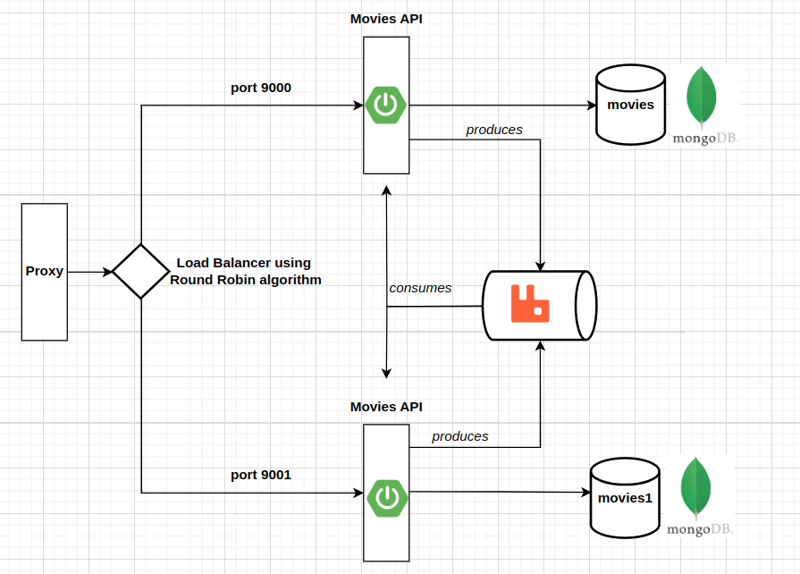

# Smart Proxy

We have 3 SpringBoot apps :
- EurekaServer
- MoviesApi
- MoviesGateway

The all work as following :

First of all we start EurekaServer where all our applications are registered and we cand view their state (up/down).

We run/start 2 instances of MoviesApi, each one with its own port and database.

Finally we run MoviesGateway which acts as a proxy, gateway and load balancer.

From other services we need mongoDB and RabbitMq up and running.

_more description here_

mvn spring-boot:run -Dspring-boot.run.profiles=dev1
mvn spring-boot:run
